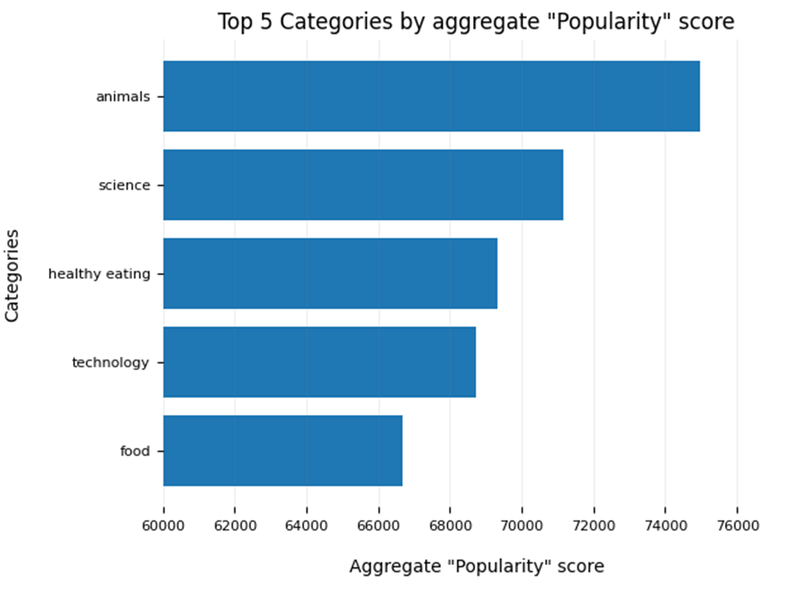
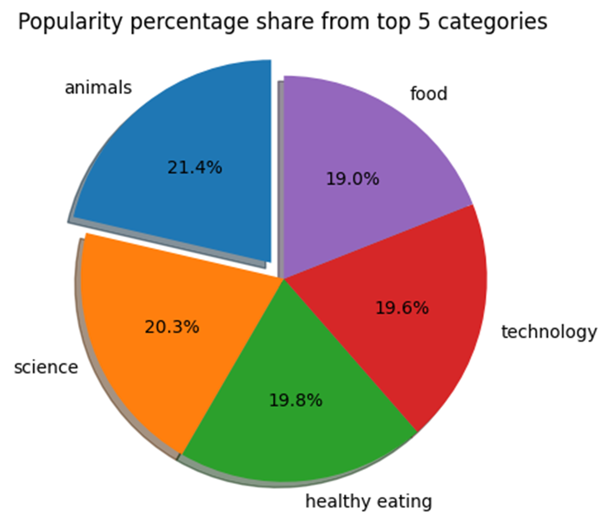

Accenture Data Analytics and Visualization:
==========================================
Social Buzz Social Buzz is a fast growing technology unicorn that need to adapt quickly to it's global scale. Accenture has begun a 3 month POC focusing on these tasks:
- An audit of Social Buzz's big data practice
- Recommendations for a successful IPO
- Analysis to find Social Buzz's top 5 most popular categories of content 

Problem for Social Buzz : 
-------------
- Over 100000 posts per day
- 36,500,000 pieces of content per year!
- But how to capitalize on it when there is so much?

Task : Analysis to find Social Buzz's top 5 most popular categories of content .

Process:
----------
So, how did we tackle this problem? 

Well we approached it in 5 steps:

1. Data understanding - The key to success on any data project is to understand the data in detail. So we took the time to understand the data model and domain of your business.
2. Data cleaning - After understanding your business, we then cleaned the available datasets and thought about what an ideal dataset should look like for this problem.
3. Data modelling - After ensuring the data was clean for analysis, we needed to process and model this data into a dataset that can precisely answer the business questions and produce the results needed.
4. Data analysis - With our new dataset, we used our analytical expertise to uncover insights from this dataset and to produce visualizations to describe the insights.
5. And finally we used these insights to unlock business decisions and to make recommendations on next steps.

Insight:
------------
From data we found that Social Buzz had a total of **16 unique categories** of posts across  sample dataset. This includes things such as Food, Culture and Sport.

As well as this, there were **1897** reactions from just the **animal category** alone! People obviously really like animals!

And also the **most common month** for users to post within was **January**. This aligns with seasonal trends of social media users that feel the need to reconnect with people after calendar events such as Christmas.

But now, onto the main question... which is... what were the top 5 most popular categories of posts?

Visualization:
-------------

From our analysis, you can see that the 
- **Top 5 most popular categories of posts** were animals, science, healthy eating, technology and food in descending order.

- Animals had an aggregate popularity score of around **74965**. 
- It is very interesting to see both food and healthy eating within the top 5, it really shows that food is a highly engaging content category. 
- Healthy eating ranks slightly higher than food, so perhaps your user base may be skewed towards healthy eaters and health-conscious people.  

- Finally, its also interesting to see science and technology too. This may suggest that people enjoy consuming factual content and snippets of content that they can learn something from.

This chart shows  the % split of popularity between the top 5 categories. There is not much difference between the share of each category, however, the difference between the 1st most popular, animals and the 2nd most popular, science, is the largest gap equal to 1.1%.

In business terms, this could suggest that the most popular category, animals, is tailing away from the rest of the categories and may continue to get more and more popular. To avoid an issue where 1 content category consumes the entire platform, it will be important for  Social buzz to ensure that any algorithms used to govern the content on the platform gives a fair balance to the content categories.

Summary:
------------------------
- We found that animals and science are the two most popular categories, suggesting that users like "real-life" and "factual" content

- We also found that food was a common theme amongst popular content and the most popular food category was healthy eating. \
This could be a signal to show the types of people that are using Social buzz  platform, and  Social buzz could use this insight to boost engagement even further. For example,  Social buzz could run a campaign with content focused on this category or work with healthy eating brands to promote content.

