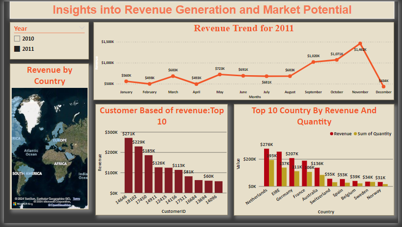

# Tata Group's Data Visualization for Senior Leadership Decision Making
-----------------------------------------

This repository contains the resources and deliverables for the Data Visualization task aimed at assisting senior leadership, specifically the CEO and CMO, in making informed decisions for the expansion strategy of an online retail store. The task involves analyzing data, cleaning it, creating visualizations, and presenting findings to the executives.

- I completed simulation for data visualizations for Tata Consultancy Services
- Prepared questions for a meeting with client senior leadership
- Created visuals for data analysis to help executives with effective decision making
 
Task Details
----------------------------------
**Task Objectives:**

- Learn how to visualize data analysis effectively.
- Use  Power BI software to create visualizations.
- Present findings to the CEO and CMO.

### Task Process:

**Data Cleanup:**
- Remove records with negative quantities and unit prices below $0.
- -Ensure data integrity for accurate analysis.

**Visualization Creation:** Develop visuals for four specific questions posed by the CEO and CMO.
Utilize Power BI to create clear and insightful visualizations.
**Video Presentation:** Develop a script and record a video presenting findings to the CEO and CMO. Explain the thought process, data cleanup, and analysis behind the visualizations.

**Visualizations Created**
- Time Series Analysis of Revenue for 2011

- Analyzes seasonal trends in revenue to aid in forecasting for the next year.
Top 10 Revenue-Generating Countries (Excluding UK)

- Identifies potential growth opportunities in key markets.
Analysis of Top 10 Customers by Revenue

- Assesses revenue concentration and customer dependency for strategic insights.
- Regional Revenue Distribution

## Key Questions for CEO taken :

1. Regional Revenue Analysis:

- Which regions generate the highest and lowest revenue?
- Insight: Evaluate revenue distribution to strategize focus areas for revenue generation and improvement.

2. Monthly Revenue Trends:

- What is the monthly revenue trend, and which months see significant increases or decreases?
- Insight: Understand seasonal fluctuations and internal impacts on sales to optimize resource allocation.
3. Top Customer Contribution:

- Who are the top customers, and how much revenue do they contribute?
- Insight: Assess customer diversification and dependency to devise customer-centric strategies.
4. Expansion Strategy:

- How can we leverage demographic data to guide expansion decisions?
- Insight: Utilize demographic insights to target potential markets and tailor expansion strategies accordingly.

## Key Questions for CMO taken :

1. Customer Reordering Patterns:

- What percentage of customers reorder, and do they purchase the same or different products?
- Insight: Identify reordering trends to tailor marketing strategies and product offerings for customer retention.
2. Reorder Frequency Analysis:

- How long do customers take to place their next order after the previous one?
- Insight: Optimize marketing efforts based on reorder frequency to enhance customer engagement and loyalty.
3. Revenue from Repeat Customers:

- What portion of revenue comes from repeat customers, and how can we increase it?
- Insight: Develop targeted campaigns to maximize revenue from loyal customers and enhance customer lifetime value.
4. Top Repeat Customers Impact:

- Who are the top repeat customers, and how much revenue do they contribute?
- Insight: Identify high-value repeat customers to personalize marketing efforts and foster long-term relationships.

**My subimission :**

1. Seasonality Analysis:

- Analysis of revenue trends reveals seasonal patterns.
- Revenue remains consistent at around $685k for the first 8 months.
- Significant increase in revenue observed from September to November, peaking at $1.5 million.
- Seasonality impacts sales, particularly in the last 4 months of the year.

2. Top 10 Countries for Growth:

- Analysis excludes the UK due to existing high demand.
- Netherlands, Ireland, Germany, and France exhibit high volumes of units sold and revenue generated.
- Suggested focus on capturing market opportunities in these countries.

3. Top 10 Customer Analysis:

- Limited variation in purchases among the top 10 customers.
- Highest revenue-generating customer only purchased 17% more than the 2nd highest.
- Indicates low customer dependency and favorable bargaining power.

4. Regional Revenue Distribution:

- Countries like Netherlands, Ireland, Germany, France, and Australia generate significant revenue.
- Opportunity for increased investment and market capture in these regions.
- Limited demand observed in Africa, Asia, and Russia, suggesting potential for expansion strategy.

## Conclusion:
By addressing these key questions, we aim to provide actionable insights for strategic decision-making. 

# Thank You!